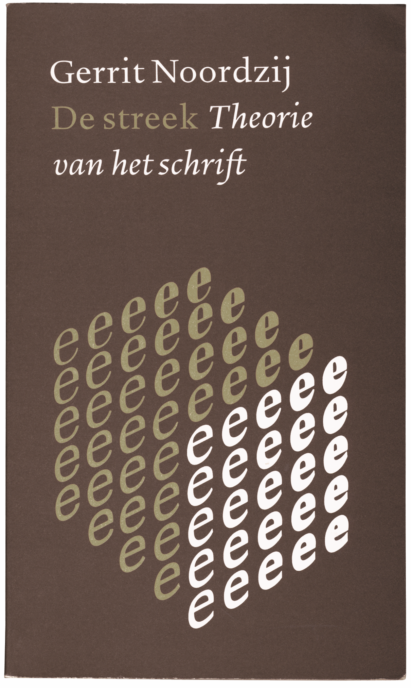
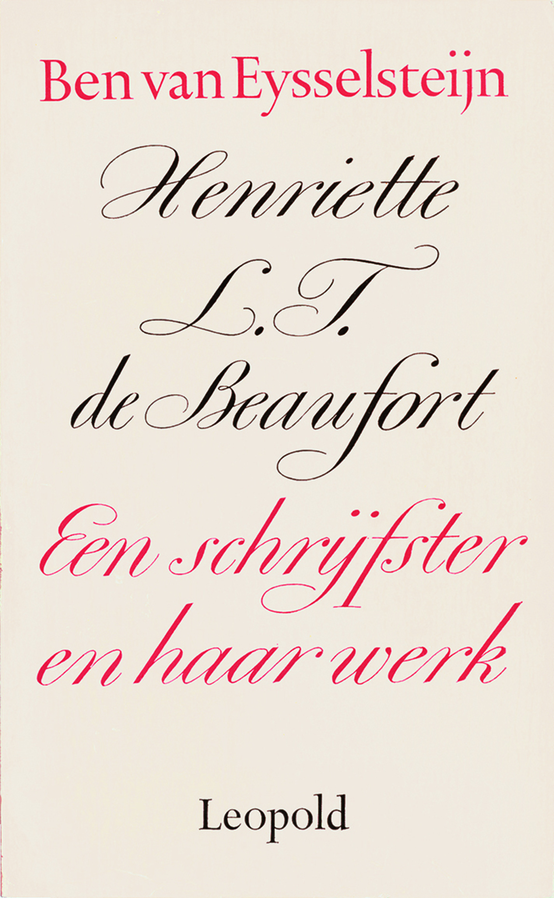
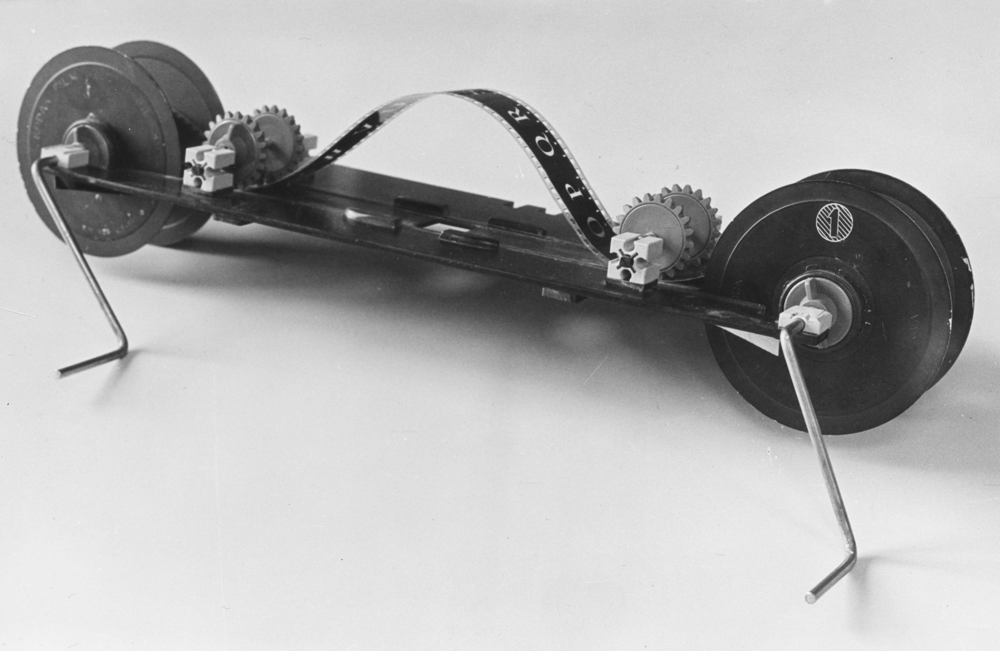
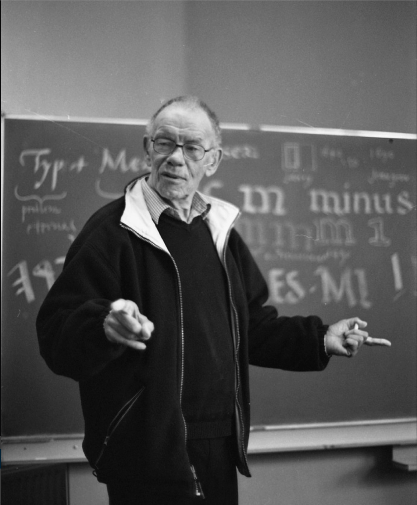

~~~ 
page = page.next # 1

content = page.select('Content')
page.name = 'Gerrit Noordzij'
page.url = 'gnoordzij.html'

content = page.select('Content')
box = content.newBanner()

~~~

# It all starts with writing

~~~
box = content.newIntroduction()
~~~

# An influential following of Gerrit Noordzij
# **By Jan Middendorp**

~~~ 
section = content.newSection()
box =  section.newMain()
~~~

Among the people who have shaped contemporary type culture, Gerrit Noordzij is one of the most remarkable characters. He is also one of the most enigmatic. A big-featured, energetic man, even at 87, he has the sharp eye of a scholar who has looked at a lot of things with the intention of making sense of them. He is most famous for a small but groundbreaking book, **The Stroke: Theory of Writing (1985)**, but his influence reaches from type design and typography to broad areas of graphic design. 

Born in Rotterdam in 1931, Noordzij has worked as a typographer, calligrapher, researcher, stone carver, historian, and type designer. He presented a calligraphy course on national public TV, which made him famous for considerably more than 15 minutes. He is, first and foremost, a teacher. His legacy is not so much in his typographic design and calligraphy, or even in his typefaces (of which just two, the lovely Ruse and the eccentric Burgundica, have been made publicly available so far), it’s in his students, and the writings documenting the teaching process. As a teacher of typography and writing at the Royal Academy of Art (KABK) in The Hague, he single-handedly caused, or created, the emergence of a whole generation of important type designers. 

Typefaces by Noordzij students have helped set the standards of digital type design. Petr and Erik van Blokland, Just van Rossum, Lucas de Groot, Albert-Jan Pool, Frank E. Blokland and Peter Verheul, and his own sons Peter Matthias and Christoph Noordzij, all took part in Noordzij’s letter program in the 1970s and 1980s. 
Since Noordzij’s retirement in 1990 they, in turn, have become teachers, creating a Noordzij school of type design within and outside the KABK. Several were instrumental in building one of the world’s most respected degrees in type design, the one-year Master Type Media course. 

In the hands of former students and their students, Noordzij’s vision has morphed into a flexible and malleable theory of letterforms.Noordzij’s core theory is the subject of his most-read and widely translated publication—the 70-odd pages of The Stroke: Theory of Writing. The elegant paperback presents an analysis of the construction of letterforms informed by historical study but firmly rooted in hands-on experience. In Noordzij’s words: “To be able to analyze writing I need to write and to be able to write I need the analysis. This circle-game is not played in the study, but rather in the workshop.”

~~~
box = section.newSide()
~~~


*[[Cover of the pivotal book The Stroke”(1985) shows 
the famous cube that visualizes three axes of his system.]]*

~~~
section = content.newSection()
box = section.newMain()
~~~

*[[Hand-lettered book cover, 1970—a rare example of Noordzij using a copperplate-like pointed-pen italic.]]*

~~~
box = section.newSide()
~~~

*[[Specimens produced by Noordzij for the author’s book, Dutch Type. Ruit and Tret are unpublished but used in many Noordzij designs, Ruse is a large family released by The Enschedé Type Foundry in 2000.]]*

~~~
section = content.newSection()
box = section.newMain()
~~~

## Finding the axes in type design

To noordzij, there is no essential difference between the written and the printed word—he defines typography as “writing with prefabricated letters.” Printing types betray their origin in (hand)writing by their construction. A typeface may show diagonal or vertical contrast or stress, referring respectively to the broad-nibbed or the pointed pen. Noordzij invented the terms “translation” and ”expansion” for these two extremes. An alphabet can have an interrupted or cursive construction, derived from the movement of the hand —is the pen lifted from the paper while shaping the character or not? The third variable in Noordzij’s scheme is the amount of contrast, from monoline to the extreme thick/thin contrast of certain 19th-century alphabets. Combined, these three “axes” form a relatively simply model—visualized in the “Noordzij cube,” which has become famous. The model helps readers and designers understand the workings of letters without having to fathom complex classification systems.

It is the serif that illustrates the fundamental difference between Noordzij’s theory and traditional type classification. An essential feature in previous classification systems, it becomes a mere byproduct in Noordzij’s model, an artifact. He argues that low contrast is inherent to the sans serif. As the contrast diminishes, the serifs disappear into the stroke. Some of Noordzij’s former students were reluctant to use the term “sans serif:” They preferred “low contrast.” Maybe some still do.
Noordzij’s model is a great tool for teaching people how to look analytically at letterforms. But like the Maximilien Vox classification system of the 1950s, it cannot be applied universally. It is incompatible with many of today’s genres and subgenres, such as almost any alphabet that involves geometric construction. Noordzij seems to get normative here, dismissing such non-traditional typefaces as “irrelevant.” However, as he has repeatedly pointed out, there is a degree of role-playing involved. He has referred to his model as “a simple invention,” suggesting that it was put forward for the sake of argument—its ambitions being provisional, its claims by no means universal. He needed his model to show his students and readers how things work; it is a sophisticated instrument of deliberately limited scope.
The theory’s bible, The Stroke, was first published in 1985 in Dutch as De Streek, but based on a more compact English booklet, The stroke of the pen (1982). In the 80s, Noordzij’s approach was seen by many of his international peers as an anachronism, even a bit of a crackpot, as if he denied the importance of the new digital tools by granting the central role in “making letters” to the pen, the brush, and the hand. 
 
At the yearly ATypI conferences one regular told me, “His lectures came across as charismatic, visionary, oracular and possibly crazy.” He was talking about a way of thinking about the making of letterforms that was independent of the medium, or the technology.
However, Noordzij was extremely curious about using computers for design. The enthusiasm of students like Petr van Blokland (who had been a computer-building hobbyist since his mid-teens and later wrote Ikarus-M, the Mac version of that pioneering font digitizer) helped him envisage the future typographic role of these tools. For Noordzij, the Mac was a DIY path to creating his own fonts—after more than a decade of frustrating negotiations with big manufacturers like Linotype and Berthold, who, at the time, still produced fonts that only worked on their own machines and systems. 
During the same period, he solved a problem he encountered when designing an endless series of book covers. As none of his fonts had been produced, there was no typesetter that could compose his headlines in his own alphabets. So, he built his own display typesetting device from a regular enlarger. In dialogue with his students, he soon became one of the most computer-savvy professors of his generation.

Yet at the same time, Noordzij’s purely analogue theory—or philosophy—on letterforms remained the starting-point. His open-mindedness stimulated his 1980s students to turn the “pen perspective” into a guiding way of thinking about digital type and lettering. The independence of Noordzij’s vision from technology gave his method flexibility, making it adaptable to the meandering development of digital tools, as well as inspiring the development of new ones. Some of the most innovative software used in today’s type development, including the WOFF web font format and Python-based apps like Robofont and Drawbot, started in the 1990s and 2000s KABK environment.

*[[Part of Noordzij’s self-made headline typesetter, 1973. Matrices are negatives on regular 35mm film.]]*

~~~
section = content.newSection()
box = section.newMain()
~~~

## A following

As designers realized that this oracle was on to something, the international influence of the “Noordzij school” began to build. The world became interested in the method behind the madness. Starting in 2005 (20 years after the original Dutch version), De Streek was published in English, French, Spanish, Brazilian Portuguese, Polish, German, and possibly more. Another major but less systematic source is the collection of thought-provoking fragments published as a one-man magazine for ATypI members, Letterletter, originally in 1984-1996, collected in a book in 2000. In the tightly knit, global type niche, Noordzij became a hero in the last 30 years—that is, after his retirement as a full-time teacher. 

Two decades ago I interviewed Noordzij twice while preparing Dutch Type. A recent interview took place on a hot summer day at his home, in the wonderful garden kept by his wife Wilme, and was more like a relaxed conversation. When I asked him what he thought of his fame having grown to global proportions after most of his teaching was done and his books had been written (although he has been lecturing occasionally, and published important articles), he volunteered an anecdote featuring the late Robert Norton, then an independent type founder who was to become Microsoft’s major typographic adviser. During the 1969 ATypI conference in Prague, Norton joined Noordzij in the hotel elevator. “When he saw me, he grinned. He said: ‘You are now the ATypI’s enfant terrible. You’ve got to watch out! One day you may become ATypI’s most venerated guru!’” Noordzij is amused at the idea of having become just that, or almost. Although he seldom attends the association’s conferences any longer—his condition doesn’t allow for much international traveling—his position does resemble Norton’s prophesy: In spirit, Noordzij is always very present, and his theories are referred to with appreciation and admiration. When asked how he feels about the way his fame has grown in his absence from the major stages, he gave me one of his crooked grins. “I don’t think about it much. It all happens behind my back. But that’s kind of comfortable, isn’t it?”

Noordzij’s fondest way of evaluating his influence and legacy is by recalling specific moments in his teaching career—meetings and dialogues that symbolize his relationship with his students and, by extrapolation, with his invisible worldwide audience. At his house, he took me to into his studio to show me, on his Apple screen, a black-and-white picture from 1962 where he is sitting at a table, surrounded by a class of male students. Noordzij had begun teaching at KABK only a couple of years before, and wouldn’t become the coordinator of the unique “letter program” until 1970. But at age 30, his vision of what a teacher should be and do was already in place. “My early attempts at teaching things differently were surprisingly well received. My memories of that time were like scenes that seemed too nice to be true: Me explaining things, and students crowding around me as if we were conspiring. Then this former student Jaap Andela posted a photo on Facebook that he took in 1962: Me sitting at a table, students standing around me, bent over my drawing. And suddenly it was there, the conspiracy, exactly like in my dreams.” So pleased is Noordzij with this little story that it has ended up in his short introduction to the new German translation of The Stroke, to be published soon.

The one element that has somehow remained obscure in the Noordzij story is where he got his skills and his knowledge. Around 1950, Noordzij was still an apprentice at an industrial Rotterdam book-binding company, with no formal education in typography. He seemed blessed with a natural talent. While working on industrial bindings, young Noordzij was unhappy about the stamped lettering, “…and so I thought,” he once recalled “Let’s do something about those letterforms.” Very little has been revealed about his steps toward the skill that is already evident in his first book cover designs, beginning in 1954. Asked about what evidently has been an intense autodidactic process (and the possible influence of his parents) Noordzij replies reluctantly. “My father worked as a bookbinder in an office book factory. He never understood a lot about my medieval methods. I figured out everything by myself, finding relevant literature in the Rotterdam city library. I read authors like [British master bookbinder] Douglas Cockerel; the famous book by Edward Johnston became meaningful to me only after 1955. Between 1948 to 1954 my own designs were still in the shadow of my remarkable colleagues, Jan van Krimpen and Helmut Salden—and I can’t say much more about it.”

In other words: No details will be revealed about the process that enabled the assistant bookbinder to develop into a lettering artist with a mature technique and sense of style, which enabled him to start working immediately for some of the best literary publishers—A.A.M. Stols and Em. Querido. When in Germany with the family, he even managed to receive an assignment from Insel publishers for the cover of their 1961 Almanac. But his German career was cut short when he was invited back to the Netherlands for the job of his life—being a teacher at The Hague’s Art Academy. 

~~~
section = content.newSection()
box = section.newMain()
~~~

## A thinker… and a prodigious producer 

For nearly 30 years, Noordzij’s teaching was pivotal in his professional life, and it became increasingly relevant to the type world. But the versatile and huge body of work he produced alongside his academic career could fill a hefty volume with hundreds of reproductions. Book jackets were where he began his career as a hired hand; they increasingly became a lab for developing ever new type designs and alphabets. But Noordzij also illustrated his book covers, designed postage stamps and typographic theatre posters, made lettering for walls and statues (which he hand-carved); and among his calligraphic work was Queen Juliana’s official abdication act of 1980. 

His type designs were first and foremost tools for making his own pages. He designed striking text faces such as Tret and Ruit to create better and more interesting book typography; but font sales were not a priority. One of his best text fonts was Ruse — although originally drawn for a series of book covers, it became a huge text family, the first and still the only one in that category that was published by his son Peter Matthias at The Enschedé Font Foundry. 

This is how Noordzij describes his urge to make new fonts: “Dissatisfaction is the main condition for any design. I make myself unhappy by envisioning a page that is incompatible with any existing lettershape. Then I start filling in the gap with hand-written word images which gradually solidify into a typeface able to carry my vision. I suddenly realize now that I always grab a book if I want to show a typeface. Then for a year or so I am perfectly happy with the result, but then a new dissatisfaction comes over me.”

He feels this urge to falsify established truths about writing and letterform construction comes from the same source. 
He refers to an essay with a hard-to-translate pun as a title: “Nieuwe letterkunde” meaning “New literature” but also “A new letterform theory.” “You can see that I try to refute all recognized truths about letters. I do that because I find the outcome usually very entertaining. Although I have gradually become a recognized authority myself, there is unfortunately nobody who dares to respond to my provocations. I think the same kind of discomfort is at work here as in the design of printing type.”

Not that Noordzij’s provocative thought experiments are limited to the typographic realm. His body of written work in Dutch includes a handwritten booklet on the advantages of mowing grass with scythe and sickle, and an idiosyncratic yet lucid paperback on subjects including page layout, scientific research and reading lessons for young children: De staart van de kat (The Cat’s Tail). 
Decades of essays and speculations were collected in the multifaceted De handen van de zeven zusters (The Hands of the Seven Sisters). The book includes pieces on photography (focus experiments that include a self-written computer program for drawing projection schemes), God’s opinion on the creation of the world, the distance of infinity, Noordzij’s improvement of poetry, countershapes in letters and words, and the gospel. 
In the title essay, he chides an eminent Dutch historian of printing and handwriting for not recognizing the seven “hands” of different nuns in a manuscript and teaches him how: By looking, very carefully, at the shape of the strokes and recognize seven different gestures. 

Which brings us back to the core of Noordzij’s approach to the letterform: To understand the structure and the personality of lettershapes, it won’t do to read about them, or look at them. To grasp the essence of a letterform, you must write.

~~~
box = section.newSide()
~~~

*[[In the last 20 years, Noordzij has given occasional 
lectures and run workshops at the Royal Academy 
for students in the Type and Media program.]]*
~~~
"""

*[[Translation
Noordzij’s demonstration of translation, the stress (or contrast) of letterforms drawn with a broad-nibbed pen held at a constant angle.]]* 

*[[Expansion
Letters drawn with a pointed pen, resulting in a vertical stress.]]*

*[[A unique 3D model of the cube (left), was made recently by Erik Van Blokland, based on Noordzij letterforms.]]*



*[[Sketches for the typeface, Tret, showing Noordzij’s rough hatching method of sketching.]]*

*[[Between the late 1970s and the 2000s, Noordzij designed hundreds of book covers for the Amsterdam publisher Van Oorschot, all with his own fonts and lettering. Some alphabets were mainly used for the work of one author (e.g. Koolhaas), others were beta versions of fonts like Tret and Ruse. At left, ]]*

"""
~~~